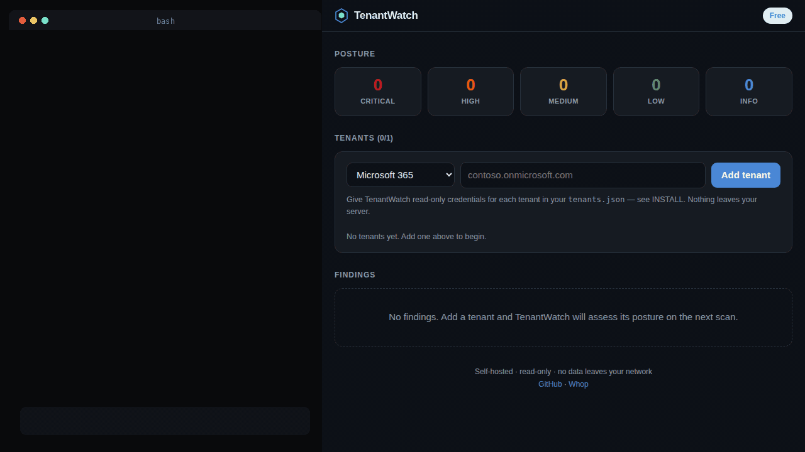

# TenantWatch

**Read-only security-posture auditing for Microsoft 365 and Google Workspace — self-hosted, no data leaves your network.**

Most small teams live entirely in M365 or Google Workspace and have never audited the security settings. TenantWatch connects read-only, checks the things that actually get organisations breached — accounts without MFA, over-permissioned third-party apps, mailboxes auto-forwarding to the outside, admin sprawl, "anyone with the link" sharing, spoofable email domains — and reports them as prioritised, self-resolving findings. Fix a problem and it clears itself on the next scan.

It runs on the [Hexward](https://github.com/nizartuanku) engine: a single Go binary, no telemetry, offline licensing. It only ever reads, and it only ever reads the tenants you give it credentials for.

```
tenantwatch                       # dashboard on 127.0.0.1:8430
tenantwatch -creds tenants.json   # read-only credentials for your tenants
```

Add a tenant as `m365:contoso.onmicrosoft.com` or `gws:contoso.co.id`.



*Real run, not a mock-up: one binary, the dashboard on localhost, and the findings the check engine actually produced for a demo tenant.*

## New in 0.2.0 — Sign-in Watch

Configuration checks tell you the door is unlocked. The sign-in log tells you somebody walked through it. 0.2.0 reads the last 7 days of sign-in activity and turns four patterns into findings — with no new database, no baseline to train, and no data leaving your server.

| Check | Severity | Catches |
|---|---|---|
| `tenant.signin-legacy-auth` | Critical | A legacy protocol (IMAP/POP/SMTP) **succeeded** — a door that cannot carry MFA, in daily use |
| `tenant.signin-admin-1fa` | Critical | An administrator completed a real sign-in with a password alone |
| `tenant.signin-spray` | Critical | Many failures across many accounts from one address — **and then one succeeded** |
| `tenant.signin-country-hop` | High | One account signing in from two countries too close together to be travel |
| `tenant.signin-suspicious` | High | Sign-ins the provider itself flagged as suspicious |

The difference between `tenant.legacy-auth` (High) and `tenant.signin-legacy-auth` (Critical) is the difference between a policy that permits something and a log that proves it happened.

## What else it checks

| Check | Severity | Catches |
|---|---|---|
| `tenant.admin-mfa` | High | Privileged accounts without MFA — the highest-value target |
| `tenant.user-mfa` | Medium | Standard accounts without MFA (aggregated coverage gap) |
| `tenant.legacy-auth` | High | Basic/legacy auth still enabled — bypasses MFA |
| `tenant.risky-oauth` | High/Med | Third-party apps granted broad mail/file access (org-wide consent = High) |
| `tenant.mail-forward` | High | Mailboxes auto-forwarding outside the org (BEC/exfil signal) |
| `tenant.admin-sprawl` | Medium | Too many standing administrator accounts |
| `tenant.external-sharing` | Medium | "Anyone with the link" / external file sharing |
| `tenant.email-auth` | Medium | Missing SPF / DKIM / weak DMARC (spoofable domain) |
| `tenant.no-conditional-access` | Medium | No enforced conditional-access policy (M365) |
| `tenant.inactive-user` | Low | Enabled accounts unused for 90+ days |

## Honest limits

TenantWatch tells you what it *couldn't* assess instead of pretending everything it didn't read is fine — those show up as `Manual review` info findings. A tenant that cannot be assessed is told so, in the dashboard, in plain words; it never gets a clean bill of health it did not earn.

- **Sign-in Watch on Microsoft 365 needs Entra ID P1 or P2.** Microsoft gates `/auditLogs/signIns` behind premium licensing, and P1 ships with Microsoft 365 **Business Premium** but *not* with Business Basic or Business Standard. On a tenant without it, every sign-in check stays silent and the dashboard says exactly why. All configuration checks are unaffected.
- **Sign-in Watch on Google Workspace has two blind spots Google itself creates**: the login audit reports no country per event (so `signin-country-hop` cannot run) and no per-event authentication strength (so `signin-admin-1fa` cannot run). Both are reported as unassessed rather than dressed up. In exchange, Google publishes its own `is_suspicious` verdict, which `tenant.signin-suspicious` surfaces.
- Sign-in checks read a **7-day window** each scan and judge it as a whole — there is no stored baseline and no learning period, so the first scan is as useful as the hundredth. Very large tenants are sampled newest-first, and the dashboard says when that happened.
- **Microsoft 365**: per-mailbox external forwarding needs an Exchange mailbox read — surfaced as a manual-review note unless the permission is present.
- **Google Workspace**: OAuth token audit needs the Reports API; Drive external-sharing policy needs Drive settings; per-user IMAP/POP is a Gmail setting — surfaced as manual-review notes.
- Email authentication (SPF/DKIM/DMARC) is read from public DNS; DKIM is best-effort (selectors vary), so its absence is reported as "not detected", never as broken.
- Unlike the rest of the Hexward line, TenantWatch needs outbound access to the Microsoft Graph / Google APIs (it reads *your* tenant, read-only). Credentials and findings stay on your server.

## Editions

| | Free (this repo) | Pro | Team |
|---|---|---|---|
| Tenants | 1 | 10 | unlimited |
| History | 30 days | 365 days | unlimited |
| Scan now / custom interval | — | ✓ | ✓ |
| Channels | webhook, syslog | + email, Slack, Telegram | + PagerDuty, Teams |

The free edition is Apache-2.0 and fully functional for one tenant. **Pro and Team** (licensed builds, offline activation): **[whop.com/tenantwatch](https://whop.com/tenantwatch)** — 14-day trial.

## Install

See [docs/INSTALL.md](docs/INSTALL.md) for the read-only app-registration (M365) and service-account (Google Workspace) setup, and [docs/USER-GUIDE.md](docs/USER-GUIDE.md) for day-to-day use. Quick start:

```sh
# from a release tarball
tar xzf tenantwatch-*-linux-amd64.tar.gz && cd tenantwatch-*
cp tenants.example.json tenants.json   # fill in your read-only credentials
./tenantwatch -creds tenants.json
# open http://127.0.0.1:8430
```

Findings can be pushed to any webhook or to a syslog collector — point `-syslog` at [Loglight](https://github.com/nizartuanku/loglight) to correlate a tenant posture change with what your logs saw.

## Part of the Hexward line

Self-hosted security tools on one engine — TLS monitoring, attack-surface discovery, canary tokens, CVE prioritisation, firewall auditing, log correlation, DMARC, and this. See the full line and the **Hexward Suite** bundle at **[whop.com/nizar-tuanku](https://whop.com/nizar-tuanku)**.

More from Nizar Tuanku: [YouTube](https://www.youtube.com/@nizartuanku7102) · [TikTok](https://www.tiktok.com/@nizartuanku) · Instagram [@nizartuanku]

## License

Apache-2.0 (free edition). See [LICENSE](LICENSE).
